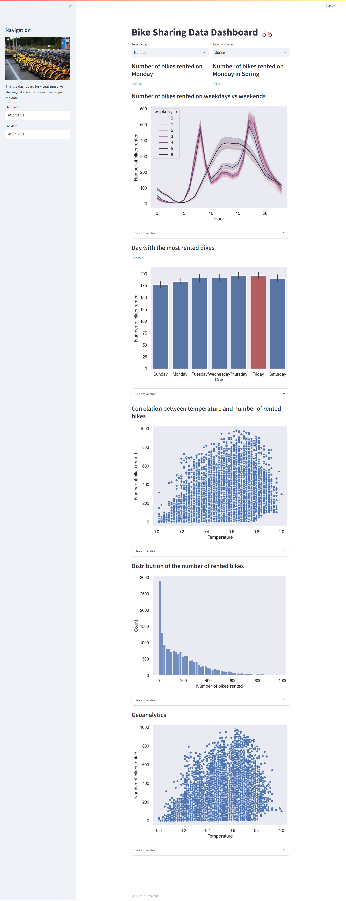

# Bike Sharing Data Dashboard 🚲

## Setup environment

```
conda create --name main-ds python=3.11.5
conda activate main-ds
pip install numpy pandas scipy matplotlib seaborn jupyter streamlit babel
```

## Run steamlit app
```
streamlit run dashboard.py
```

## Deploy dashboard
[Bike Sharing Dashboard](https://bike-data.streamlit.app/)
<br><br>

## GitHub Resources 
[Github Repository](https://github.com/isnanramalia/BikeSharing-DataAnalysis)
or
[Github Repository 2](https://github.com/isnanramalia/dicoding-latihanDataMining/tree/main/proyek_akhir)
<br><br>

## Screen capture dashboard

